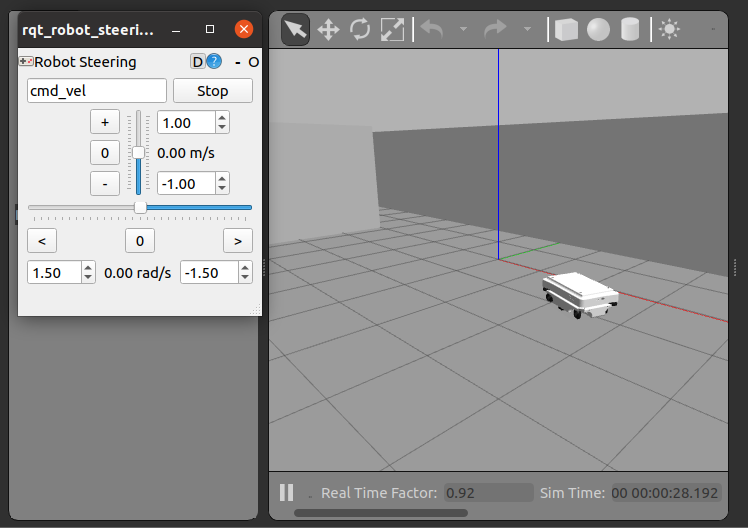
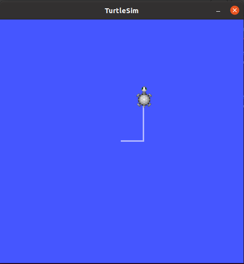

# ROS-Workshops 0MR - Mobilni roboti

V rámci tohoto workshopu budou představeny základní techniky ovládání mobilních robotů v systému ROS1. Hlavní linii workshopu určuje prezentace v podobě pdf. Dalšími opěrnými pomůckami je bash script pro přímé ovladání z terminálu OS Ubuntu, a Python script pro vlastní řízení z balíku v systému ROS z catkin pracovního prostoru.

<table>
    <tr>
        <td></td>
        <td></td>
    </tr>
</table>