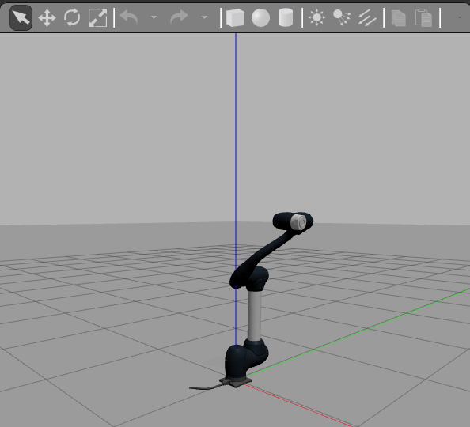
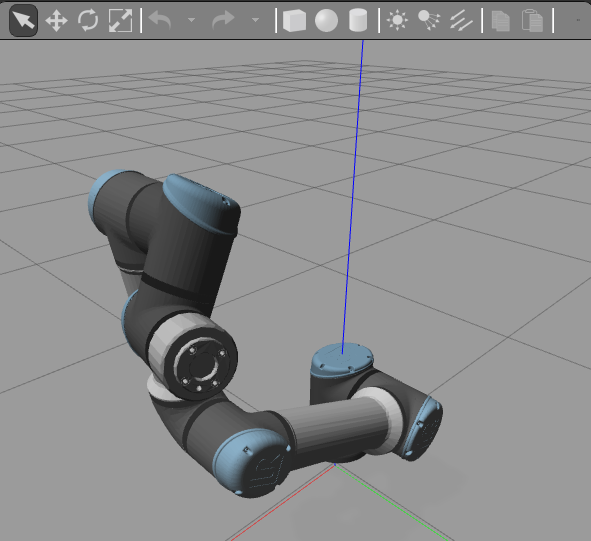

# ROS-Workshops VRM - Programování robotů a manipulátorů

V rámci tohoto workshopu budou představeny základní techniky ovládání manipulátorů v systému ROS1. Hlavní linii workshopu určuje prezentace v podobě pdf. V prezentace se nacházáejí zásadní informace pro tento workshop. Kdy pomůckou je upravený python script pro demonstraci využítí frameworku MoveIT.

<table>
    <tr>
        <td></td>
        <td></td>
    </tr>
</table>